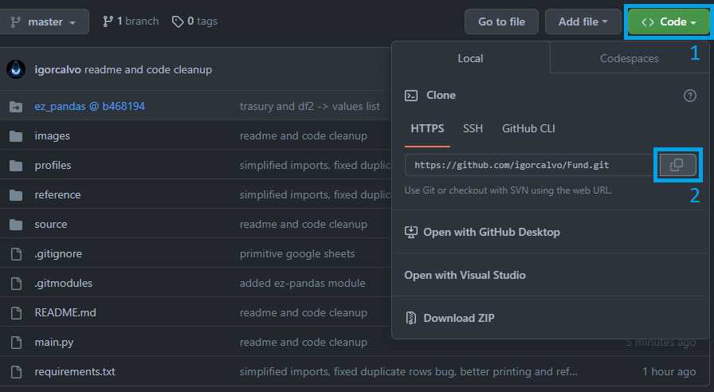

## Prerequisites

- Install [Python](https://www.python.org/downloads/)

Test by typing ```python --version``` into command prompt or powershell

```bash
Python 3.10.1
```

- Install [Git](https://git-scm.com/download/win)

## Cloning this code

With git installed you can now get a copy of this code into your machine:

1. Create a new folder for it
1. Open either powershell or git bash and navigate to the newly created folder with: ```cd C:/path/to/new_folder```
1. Copy the repo URL as shown in the image:



4. Run:
```bash
git clone <url>
```


## Running the code

Before running it, it's necessary to install the requirements once:

```bash
pip install -r requirements.txt
```

Then you should be good to go with:

```bash
python main.py
```

## Parameters

```python
if __name__ == "__main__":
	statements = ['DRE', 'DFC_MI', 'BPA', 'BPP']
	generate_statements(statement='', years_back=5, export_raw_data=False, multi_core=True)
```

Parameter | Description
--- | ---
statement | If not specified, will default to all available statements
year_back | Number of years to take into account. Can be set to only one year e.g.: 2021
export_raw_data | Whether or not to export a .xlsx with the raw data, before any processing
multi_core | Whether or not multithreading will be enabled.

## Updating the code

```bash
cd C:/path/to/new_folder
git pull
```